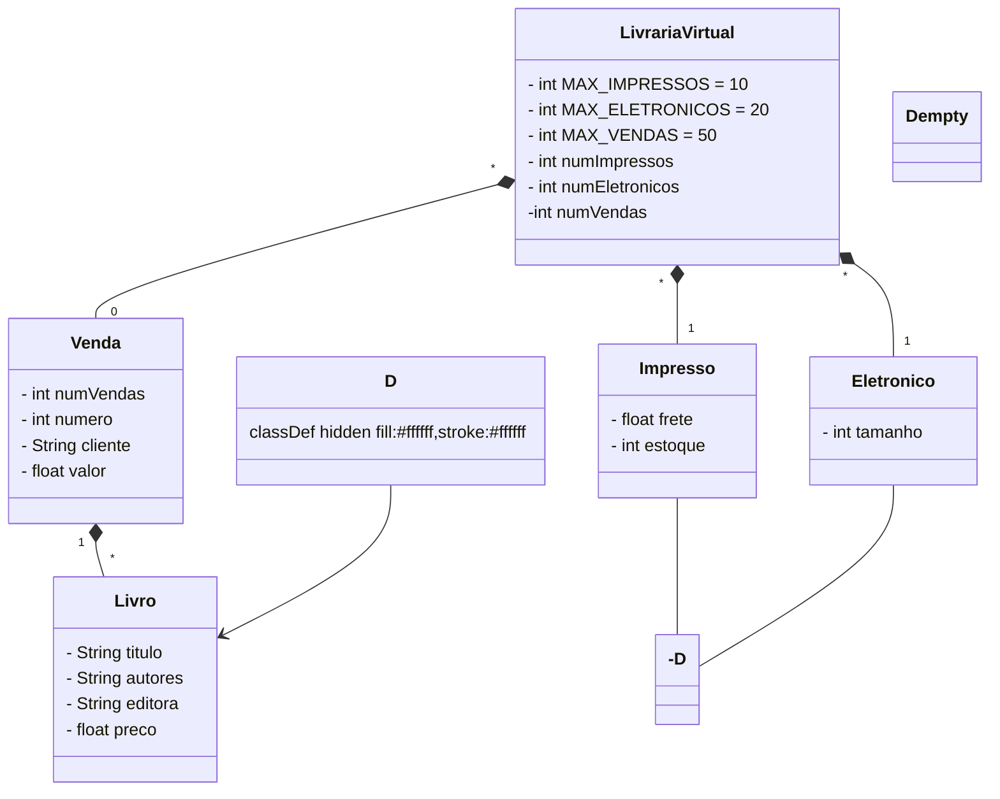

##Diagrama de Classe

```mermaid
classDiagram
  class LivrariaVirtual {
    - int MAX_IMPRESSOS = 10
    - int MAX_ELETRONICOS = 20
    - int MAX_VENDAS = 50
    - int numImpressos
    - int numEletronicos
	-int numVendas
  }

  class Venda {
    - int numVendas
    - int numero
    - String cliente
    - float valor
  }

  class Impresso {
    - float frete
    - int estoque
  }

  class Eletronico {
    - int tamanho
  }

  class Livro {
    - String titulo
    - String autores
    - String editora
    - float preco
  }

class D {
    %% Define a classe D como um placeholder invisível
    classDef hidden fill:#ffffff,stroke:#ffffff;
  }

  LivrariaVirtual "*" *-- "0" Venda
  LivrariaVirtual "*" *-- "1" Impresso
  LivrariaVirtual "*" *-- "1" Eletronico
  Venda "1" *-- "*" Livro
Impresso --- D
  Eletronico --- D
  D --> Livro

  %% Aplicando o estilo empty ao D
  class D empty
```
